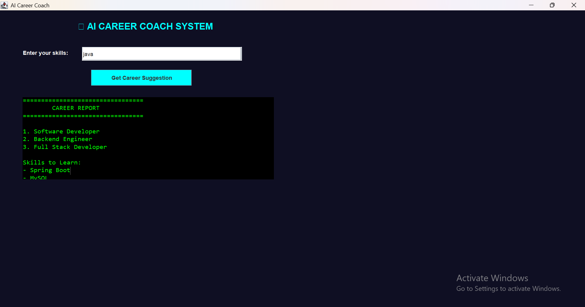

# 🚀 CareerIQ – AI-Powered Career Guidance System

An interactive Java Swing-based desktop application that suggests suitable career paths based on user-entered skills.

## 📸 Project Screenshot

## 💡 Features
- Skill-based career recommendations
- AI-inspired rule-based decision logic
- Skill match score calculation
- Interactive Java Swing GUI
- Personalized career suggestions

## 🛠️ Tech Stack
- Java
- Swing (GUI)
- OOP Concepts
- Event Handling

## ▶️ How to Run
1. Clone the repository
2. Open the project in any Java IDE
3. Run the main Java file
